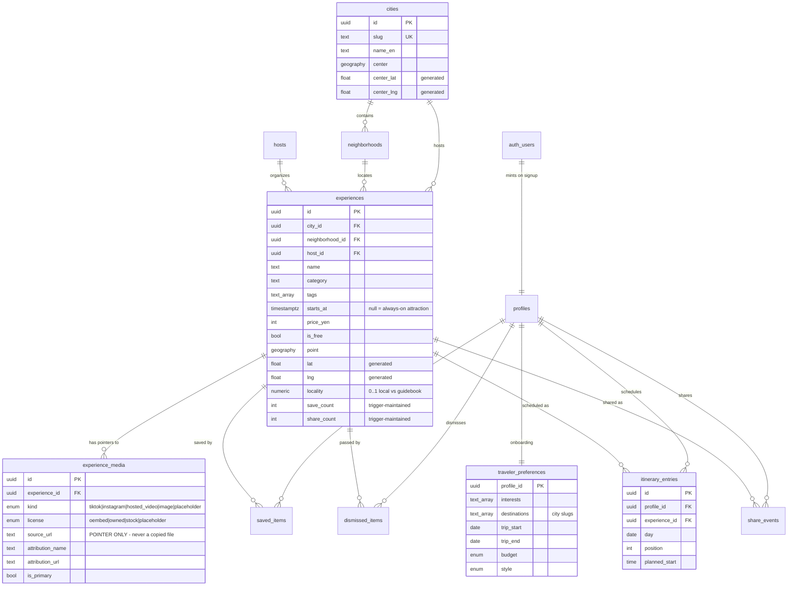

# Architecture

Backend and engine only. The UI is built by a separate team against the RPC
contract in [`api-contract.md`](./api-contract.md).

---

## 1. System architecture

There is **no application server**. The client calls Postgres functions through
PostgREST, and Postgres enforces every permission itself through Row Level
Security. That removes the tier which usually breaks under time pressure, and
RLS is the pattern this product would use in production anyway — not a
hackathon shortcut.

```
╔════════════════════════════════════════════════════════════════════════════╗
║  CLIENT — built by the UI team (Next.js / Tailwind / shadcn)               ║
║                                                                            ║
║   Explore feed · Saved · Itinerary · Profile                               ║
║        │                                                                   ║
║        │  supabase-js  →  rpc('feed'), rpc('save_experience'), …           ║
║        │  anon JWT attached to every call                                  ║
║        │                                                                   ║
║        └─ media rendered client-side:                                      ║
║             tiktok/instagram → official oEmbed endpoint (keyless, 2026)    ║
║             placeholder      → local asset, no network                     ║
╚═══════════════════════════════╤════════════════════════════════════════════╝
                                │ HTTPS
╔═══════════════════════════════▼════════════════════════════════════════════╗
║  SUPABASE EDGE                                                             ║
║    GoTrue (anonymous sign-in)  ·  PostgREST (RPC)  ·  Storage (avatars)    ║
╚═══════════════════════════════╤════════════════════════════════════════════╝
                                │ SQL, as role `authenticated`
╔═══════════════════════════════▼════════════════════════════════════════════╗
║  POSTGRES + POSTGIS                                                        ║
║                                                                            ║
║  ── RLS ─────────────────────────────────────────────────────────────────  ║
║   catalogue (cities, experiences, media, hosts)   → public read            ║
║   personal  (prefs, saves, dismissals, itinerary) → owner only,            ║
║                                                     via current_profile_id ║
║                                                                            ║
║  ── FUNCTIONS = the entire API ──────────────────────────────────────────  ║
║   read    feed · explore · explore_sections · experience_detail            ║
║           my_saved · my_itinerary · my_profile · onboarding_options        ║
║   write   save_onboarding · update_profile · save/unsave_experience        ║
║           dismiss_experience · undo_dismiss · share_experience             ║
║           add_to_itinerary · update_itinerary_entry · remove_from_itinerary║
║                                                                            ║
║  ── VIEW ────────────────────────────────────────────────────────────────  ║
║   experience_cards   one card shape reused by every surface                ║
║                                                                            ║
║  ── TRIGGERS ────────────────────────────────────────────────────────────  ║
║   saved_items  → experiences.save_count      (denormalised social proof)   ║
║   share_events → experiences.share_count                                   ║
║   auth.users   → mint a profile on first sign-in                           ║
╚═══════════════════════════════▲════════════════════════════════════════════╝
                                │ service-role, offline, never during a demo
        ┌───────────────────────┴────────────────────────┐
        │                                                │
  ingest_places.py                              enrich_tavily.py
  Overpass / event sources → experiences        Tavily → blurbs, hidden gems
        │                                                │
        └──────────────► stay22_links.py ◄───────────────┘
                         accommodation affiliate URLs
```

**Why the ingestion lane is separate.** Everything that touches a third party
runs *before* the demo and writes to the database. Nothing in the request path
depends on Overpass, Tavily, or Stay22 being reachable while a judge is
watching.

---

## 2. Data model



### Three modelling decisions worth defending

**Events and attractions are one table.** The difference between "Tenjin Matsuri
on the 24th" and "teamLab, open daily" is whether `starts_at` is null — not what
kind of row it is. One table means the feed, the scoring, the itinerary, and
search each have one code path instead of two that drift apart.

**Media rows are pointers, not files.** `experience_media` stores a canonical
post URL plus attribution. There is deliberately no column for video bytes or a
rehosted path. Embeds resolve client-side through the official TikTok and
Instagram oEmbed endpoints, both keyless as of 2026. Scraping and rehosting
would be a copyright and ToS problem, so the schema makes the wrong thing
impossible rather than merely discouraged.

**Dismissals are stored, not discarded.** A swipe-left is the strongest signal
the traveler produces. Keeping the row lets the engine down-weight the whole
category, not just hide one card.

---

## 3. End-to-end dataflow — the demo journey

```
TRAVELER                CLIENT                    POSTGRES
   │                      │                          │
   │  opens app           │                          │
   ├─────────────────────►│  signInAnonymously()     │
   │                      ├─────────────────────────►│  trigger on auth.users
   │                      │                          │  └─► INSERT profiles
   │                      │                          │
   │                      │  rpc onboarding_options()│
   │                      ├─────────────────────────►│  interests + cities +
   │                      │◄─────────────────────────┤  neighborhoods, 1 doc
   │  picks interests,    │                          │
   │  dates, budget,      │  rpc save_onboarding(…)  │
   │  cities, style       ├─────────────────────────►│  UPSERT traveler_prefs
   ├─────────────────────►│                          │
   │                      │                          │
   │                      │  rpc feed(limit 20)      │
   │                      ├─────────────────────────►│  experience_scores()
   │                      │                          │    ├ interest overlap
   │                      │                          │    ├ destination match
   │                      │                          │    ├ trip-date fit
   │                      │                          │    ├ budget fit
   │                      │                          │    ├ style fit
   │                      │                          │    ├ save/dismiss affinity
   │                      │                          │    ├ locality bonus
   │                      │                          │    └ social proof (damped)
   │                      │◄─────────────────────────┤  cards + score + reasons[]
   │  sees cards with     │                          │
   │  "Because you like   │  (media: oEmbed resolved │
   │   street food"       │   client-side, or        │
   │                      │   placeholder)           │
   │                      │                          │
   │  swipe LEFT          │  rpc dismiss_experience  │
   ├─────────────────────►├─────────────────────────►│  INSERT dismissed_items
   │                      │                          │  └─► category down-weighted
   │                      │                          │      on the NEXT feed call
   │  swipe RIGHT         │  rpc save_experience     │
   ├─────────────────────►├─────────────────────────►│  INSERT saved_items
   │                      │                          │  ├─► trigger: save_count++
   │                      │                          │  └─► clears any dismissal
   │                      │                          │
   │  taps a card         │  rpc experience_detail   │
   ├─────────────────────►├─────────────────────────►│  ONE call returns:
   │                      │◄─────────────────────────┤  card + all media + host
   │                      │                          │  + reasons + 6 related
   │                      │                          │
   │  "Add to itinerary"  │  rpc add_to_itinerary    │
   ├─────────────────────►├─────────────────────────►│  INSERT itinerary_entries
   │                      │                          │  ├─ day defaults: event date
   │                      │                          │  │  → trip_start → today
   │                      │                          │  ├─► also saves it
   │                      │                          │  └─► clears any dismissal
   │                      │                          │
   │  opens Itinerary tab │  rpc my_itinerary()      │
   │                      ├─────────────────────────►│  grouped by day,
   │                      │◄─────────────────────────┤  ordered by position,
   │  sees a timeline     │                          │  with per-day yen total
   │                      │                          │
   │  refreshes the page  │  session persists →      │  state is in Postgres,
   ├─────────────────────►│  same profile, same data │  not localStorage
```

**Why refresh survives.** Demo state lives in Postgres keyed to the anonymous
auth user, and the Supabase session persists in the browser. A page refresh
re-attaches to the same profile rather than resetting the demo — which is one
of the explicit conditions in the definition of done.

---

## 4. How one card gets its score and its explanation

The scoring pass emits the number **and** the sentence together, in the same
expression. They cannot drift apart, so the "why" a judge reads is literally the
reason the card ranked where it did — not a second guess about it.

```
                    traveler_preferences        experiences
                    interests, destinations,    category, tags, city,
                    trip dates, budget, style   starts_at, price, locality
                              │                        │
                              └───────────┬────────────┘
                                          ▼
                              ┌───────────────────────┐
    saved_items / ───────────►│  experience_scores()  │
    dismissed_items           │                       │
    (category affinity)       │  dismissed → EXCLUDED │
                              └───────────┬───────────┘
                                          │
              ┌───────────────────────────┼──────────────────────────┐
              ▼                                                      ▼
      score  numeric                                        reasons  text[]
      ───────────────                                       ─────────────────
      interest overlap      +3.0        ──────────────►  "Because you like street food"
      destination match     +2.5 / −3.5 ──────────────►  "In Osaka"
      neighborhood match    +1.0        ──────────────►  "In Shibuya, where you're staying"
      in trip window        +2.5        ──────────────►  "Happening during your Osaka dates"
      always-on attraction  +0.8
      budget fit            +1.5 / scaled penalty
      travel style          +1.0        ──────────────►  "Good for group travel"
      saved this category   +0.5 each (cap 1.5)  ─────►  "You have saved food before"
      dismissed category    −0.75 each (cap 2.0)
      locality              +1.2 × locality  ─────────►  "Locally hosted, not on the
                                                          tourist trail"
      happening ≤ 7 days    +0.8        ──────────────►  "Happening this week"
      social proof          +ln(saves) × 0.25, capped at 1.0
```

**Two deliberate choices in that table.** A wrong destination is *penalised*,
not merely unrewarded — someone who said they are going to Kyoto should not see
Tokyo at the top however well it matches on taste. And the budget penalty scales
with how badly the price overshoots, because a flat penalty let a ¥14,000
kaiseki outrank free things for a shoestring traveler.

Social proof is deliberately damped and capped. Popularity should nudge the
ordering, never dominate it, or the feed collapses to the same handful of cards
for every traveler — which is the exact failure the product exists to avoid.

---

## 5. Sponsor integrations

All three run **offline, before the demo**, and write to the database. Nothing
in the request path can be broken by a third party being slow or down.

| Sponsor | Role | Where it lands |
|---|---|---|
| **Stay22** | Direct Travel API — live accommodation from Booking, Expedia, Hotels.com, VRBO | `experiences.stay22_url`, surfaced on detail + itinerary |
| **Tavily** | Build-time enrichment: blurbs, "known for", hidden-gem signals, and finding genuinely embeddable public posts | `experiences.description`, `locality`, `experience_media` |
| **AeroXplorer** | Arrival context — flight status feeding a "you just landed" first-day route | Optional; not on the core path |
```
